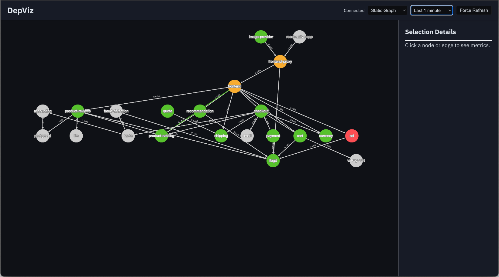

# DepViz

> See [A research lab for automating incident triage](https://williewheeler.com/posts/research-lab-for-automating-incident-triage/) for a blog post introducing DepViz.

Real-time dynamic service dependency graph visualization from OpenTelemetry traces.



DepViz consists of two main components:
- **Server**: A Python-based OTLP gRPC receiver that processes incoming traces, aggregates service dependencies, and provides a REST/WebSocket API.
- **UI**: A web interface built with TypeScript and Cytoscape.js that visualizes the service topology in real-time.

### Relationship to OpenTelemetry Demo

DepViz is designed to work alongside the [OpenTelemetry Demo](https://github.com/open-telemetry/opentelemetry-demo). Follow the [OTel Demo instructions](https://opentelemetry.io/docs/demo/kubernetes-deployment/) for information on deploying and undeploying the demo to your k8s cluster.

DepViz consumes traces produced by the demo services to build a live map of the architecture, providing immediate visibility into service relationships, latency, and error rates.

## Deployment to Kubernetes

To deploy DepViz alongside the OpenTelemetry Demo in a Kubernetes cluster (e.g., using `kind` or `minikube`), follow these steps:

### 1. Build and Load Images
First, build the Docker images for both the server and the UI, then load them into your local cluster.

```bash
# Build Server
cd server
docker build -t depviz-server:dev .
kind load docker-image depviz-server:dev  # Or 'minikube image load depviz-server:dev'

# Build UI
cd ../ui
docker build -t depviz-ui:dev .
kind load docker-image depviz-ui:dev      # Or 'minikube image load depviz-ui:dev'
```

### 2. Deploy DepViz Components
Apply the Kubernetes manifests for the server and the UI.

```bash
# From the project root
kubectl apply -f server/k8s/depviz-server.yaml
kubectl apply -f ui/k8s/depviz-ui.yaml
```

### 3. Configure OpenTelemetry Collector
To feed traces into DepViz, you need to update the OpenTelemetry Collector configuration in your cluster.

1.  Locate the ConfigMap for your OTel Collector agent (e.g., `otel-collector-agent`).
2.  Add a new OTLP exporter pointing to `depviz-server:4317`.
3.  Add this exporter to your traces pipeline.

Example configuration snippet:
```yaml
exporters:
  otlp/depviz:
    endpoint: depviz-server:4317
    tls:
      insecure: true

service:
  pipelines:
    traces:
      exporters: [otlp/jaeger, otlp/depviz, debug]
```

### 4. Restart the OTel Collector
Restart the OTel Collector to apply the new configuration:

```bash
kubectl rollout restart deployment/otel-collector-agent
```

### 5. Access the UI
Port-forward to the UI service to view the dashboard:

```bash
kubectl port-forward deploy/depviz-ui 8001:8001
```
Open your browser and navigate to `http://localhost:8001`.

## Local development

For local development, it's more convenient to run the server and UI components on the host instead of running them in
the k8s cluster. To start the server:

```bash
cd server
poetry shell
python3 src/depviz_server/main.py
```

To start the UI:

```bash
cd ui
npm install
npm run build
npm run dev
```

In the OTel Collector config map, use host.docker.internal:4317 for the OTLP exporter endpoint. Then restart the OTel
Collector as described in the previous section.

## Features

### 1. Automatic topology discovery from OTLP traces
Infers service-to-service dependencies directly from distributed traces, eliminating the need for manually maintained service maps.

### 2. Real-time dependency service dependency graph
Continuously updates a directed service graph as trace data streams in, providing an always-current view of runtime architecture.

### 3. Health overlay on nodes and edges
Visualizes system health directly on the graph using latency and error metrics, allowing bottlenecks and failure propagation paths to surface immediately.

### 4. Interactive node and edge inspection
Enables click-through exploration of services and dependencies, exposing call volume, latency percentiles, and error rates.

### 5. Time-windowed graph view
Allows users to view dependency topology over selectable time ranges to observe topology drift and incident evolution.

### 6. Native OpenTelemetry integration
Consumes OTLP trace data via gRPC directly from the OpenTelemetry Collector, demonstrating standards-based observability integration.

### 7. Exportable visualization
Supports exporting the dependency graph as an image for sharing, documentation, or incident reports.

## See also

- [Grafana Tempo service graphs](https://github.com/grafana/tempo/tree/main/modules/generator/processor/servicegraphs)
- [OpenTelemetry service graph connector](https://github.com/open-telemetry/opentelemetry-collector-contrib/tree/main/connector/servicegraphconnector)

